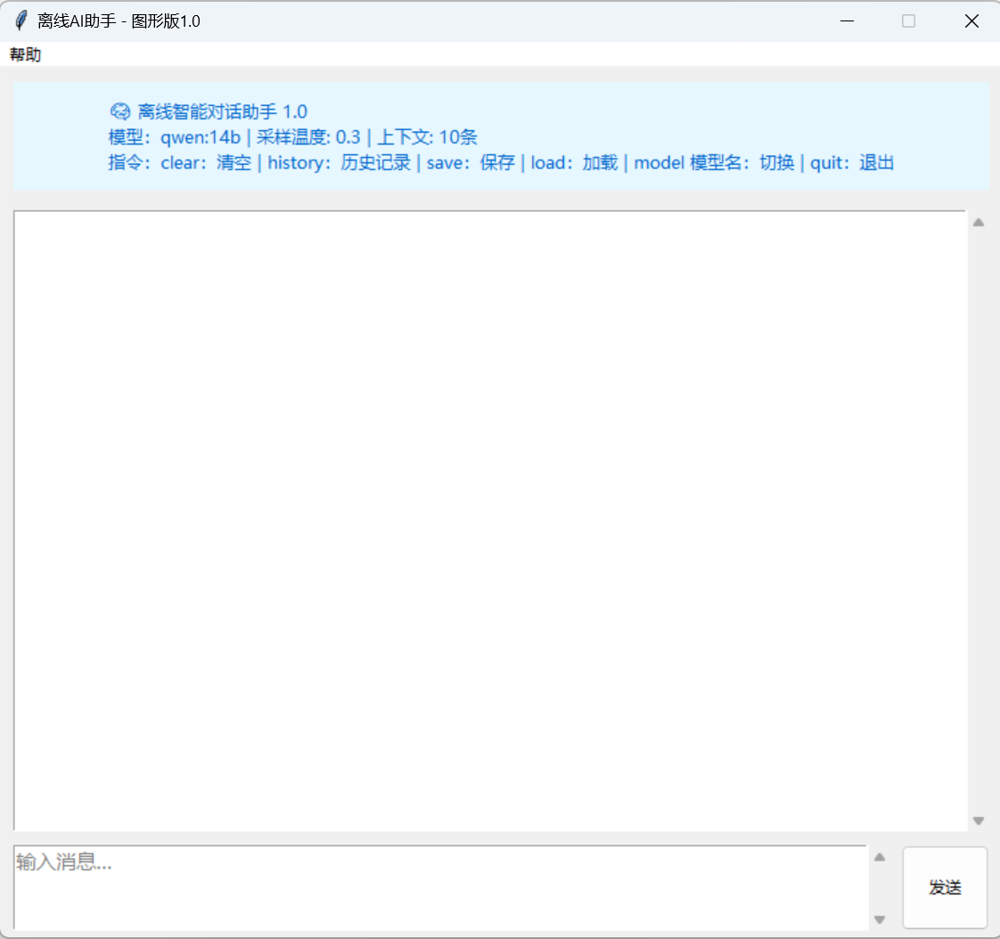

离线 AI 助手 - 图形版 2.0
基于 Ollama + Python Tkinter 开发的离线智能对话助手，无需联网即可在本地运行，支持中英文智能对话、上下文记忆、快捷指令操作，新增 AI Agent 智能体能力。
🚀 快速开始
环境准备安装 Python 3.10+安装并启动 Ollama 服务：Ollama 官网 下载安装，运行 ollama serve下载默认模型：ollama pull qwen:14b（可在 config.json 中切换其他 Ollama 模型）
运行程序
bash
运行
# 克隆项目
git clone https://github.com/[ZSR-123]/MyChatAI.git
cd MyChatAI

# 安装依赖
pip install -r requirements.txt

# 运行主程序
python main.py
打包为独立 EXE（可选）
bash
运行
# 安装打包工具
pip install pyinstaller
# 执行打包
pyinstaller --onefile --windowed --name "离线AI助手2.0" --add-data "config.json;." main.py
✨ 功能特性✅ 离线运行：基于 Ollama 本地模型，完全无需联网✅ 图形界面：简洁直观的 Tkinter GUI，操作友好✅ 智能对话：自动识别中英文，支持上下文记忆（最多 10 条历史）✅ 快捷指令：内置 clear/history/save/load/model/quit 等指令✅ 记录持久化：自动保存聊天记录到 logs/chat_history.json，支持加载历史✅ 异常保护：程序出错不闪退，友好提示用户✅ AI Agent 智能体：支持实时时间查询、数学精准计算、对话统计、自动保存记录✅ 知识严谨优化：拒绝编造信息，纠正错误引导，回答准确且前后一致✅ EXE 打包支持：可一键打包为独立可执行文件，无需 Python 环境直接运行
📖 指令说明
表格
指令	功能描述
clear	清空当前所有聊天记录
history	查看最近 10 条聊天历史
save	保存当前对话到本地 logs/chat_history.json
load	加载之前保存的聊天记录
model 模型名	切换 Ollama 模型（例如：model qwen:7b）
quit	退出程序
👨‍💻 开发者信息开发者：张思睿GitHub：ZSR-123技术栈：Python 3.x + Tkinter + Ollama API项目版本：2.0项目初衷：学习离线 AI 对话系统开发，实践 GUI 界面与本地模型调用，打造轻量化 AI Agent 应用
🤝 致谢与声明本项目在 AI 辅助开发的支持下完成，核心逻辑、界面优化与问题调试均获得技术指导与帮助。项目所有代码均为独立实现与整理，遵循开源精神分享。
📸 界面预览

📝 更新日志v2.0 (2026-05-09)
升级为图形版 2.0，优化整体交互体验
新增 AI Agent 智能体功能（时间查询、数学计算、对话统计、自动保存）
强化知识严谨性，拒绝编造信息，支持纠正用户错误
新增 EXE 独立打包支持，可生成桌面可执行文件
优化上下文逻辑，提升回答稳定性
v1.0 (2026-03-22)
实现基础图形界面
支持中英文智能对话
添加上下文记忆功能
实现快捷指令操作
完善聊天记录保存与加载
优化界面显示与换行逻辑
